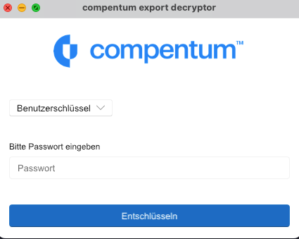

# Datenexport

compentum bietet einen vollständigen Ende-zu-Ende Verschlüsselten Datenexport ihrer Verfahren und Einstellungen an.
Dies ermöglicht Ihrem Unternehmen alle Verfahren offline zu speichern.

Im Gegensatz zu dem Einzelexport eines Verfahrenes, welches als PDF geliefert wird, ist der vollständige Datenexport maschinenlesbaren Format (json) und beinhaltet:

- Angelegte Portale
- Verschlüsselte Benutzerschlüssel und Informationen
- Alle verschlüsselten Verfahren
- Kategorien
- Organisationsinformationen

## Export beantragen

Einen Export Ihrer Daten können Sie unter den persönlichen Einstellungen beantragen. Der export nimmt etwas Zeit in Anspruch und sobald dieser zur Verfügung steht, bekommen Sie eine E-Mail und können den Export als Archiv herunterladen.

## Inhalt des Exports

Da die Verfahren Ende-zu-Ende Verschlüsselt sind, haben wir keinen Zugriff darauf. Deswegen werden diese auch verschlüsselt exportiert. Sie können diese jedoch mit der `compentum` Anwendung lokal entschlüsseln.

Im entpackten Archiv finden Sie folgende Dateien:

- `reports.json`  beinhaltet alle Verfahren
- `organization.json` beinhaltet alle Informationen der Organisation
- `user_keys.json` beinhaltet den Benutzerschlüssel
- `master_keys.json` beinhaltet den Wiederherstellungsschlüssel
- `attachments` in diesem Ordner befinden sich alle Anhänge. Sortiert nach Verfahrens-ID und dann Nachrichten-Id. 

Außerdem befinden sich noch die Entschlüsselungs-Anwendungen in dem Achriv.

| Name | Betriebsystem |
| --- | --- |
| compentum_Decryptor_Windows_x86_64.exe | Windows 64 Bit|
| compentum_Decryptor_Windows_aarch64.exe | Windows 64 Bit für ARM |
| compentum_Decryptor_macOS_aarch64 | MacOS ARM (M1, M2, M3) |
| compentum_Decryptor_macOS_x86_64 | MacOS Intel CPU |

## Export entschlüsseln

Um den export zu entschlüsseln, reicht ein Klick auf die jeweilige `compentum_Decryptor` Anwendung aus. Für moderne Macs mit M1 oder M2 Prozessor, sollte die `aarch64` version genommen werden. Bei älteren Macbooks die `x86_64` version.

Bei Windows wird in aller Regel die `compentum_Decryptor_Windows_x86_64` funktionieren, außer bei bestimmten mobilen Geräten die auf ARM basieren.

Nach dem Ausführen, können Sie Ihr Passwort eingeben und auch auswählen ob Sie mit dem Benutzerpasswort oder dem Wiederherstellungspasswort entschlüsseln wollen.

Dann werden die Verfahren und die Anhänge entschlüsselt. Dies kann je nachdem wie viele Verfahren Sie haben, mehrere Minuten dauern.

Sie erhalten im gleichen Ordner eine `reports_entschlüsselt.json` welche alle Entschlüsselten Daten beinhaltet.
Die Anhänge verbleiben in den jeweiligen Ordnern.
