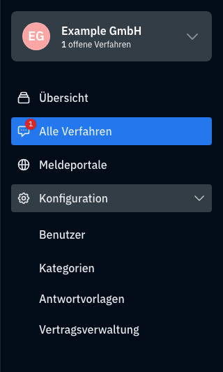

# Benutzeroberfläche

## Startseite

Die Startseite bietet eine Übersicht mit verschiedenen Statistiken. Diese können für alle Portale kumuliert oder für spezielle Meldeportale einzeln ausgegeben werden.

Dafür können Sie oben in der Auswahl, das jeweilige Meldeportal auswählen, für welches Sie die Statistiken sehen wollen.

### Statistiken
---
Folgende Statistiken bietet compentum an:

- Offene, neue und abgeschlossene Verfahren in Zahlen
- Offene Fälle nach Kategorie
- Einreichungen pro Monat für die letzten 6 Monate
- Verfahren nach Status 

### Neuste Verfahren
---
compentum zeigt außerdem auch eine Liste der fünf neusten Verfahren an.

## Navigation

compentum bietet eine einfache Navigation an, die es Ihnen erlaubt einen optimierten Workflow beim Bearbeiten und managen von Verfahren zu haben.

### Organisationswechsler

Die oberste Schaltfläche bietet Ihnen die Möglichkeit an, Ihre Organisation zu wechseln oder weitere zu erstellen.

