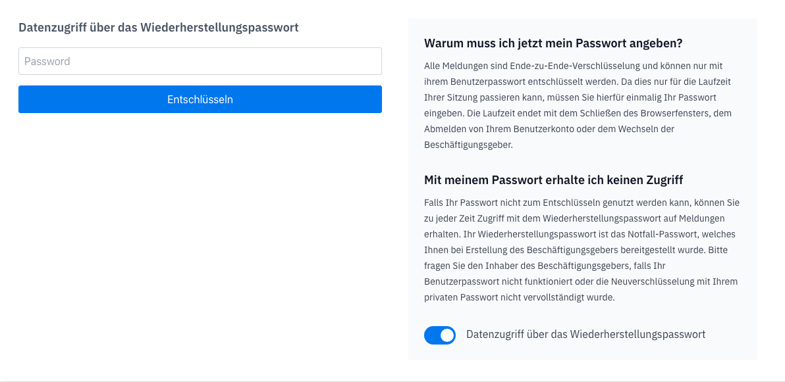

# Verschlüsselung

## Ende-zu-Ende Verschlüsselung

Durch die Verwendung einer clientseitigen **Ende-zu-Ende-Verschlüsselung** werden Ihre Hinweise zu keinem Zeitpunkt unverschlüsselt auf unserem Server gespeichert. Mehrere Verschlüsselungsinstanzen mit einem öffentlichen und privaten Schlüssel und zugehörigen Zertifikaten gewährleistet diesen Schutz.  
  
Sowohl Ihre Daten selbst als auch der Transfer sind vollständig verschlüsselt.  

So erhalten weder wir von compentum, noch Dritte Einsicht oder Zugriff auf Ihre sensiblen Daten.

Erfahren Sie in unserem [Whitepaper](https://compentum.de/assets/wp-e2ee.pdf) im Detail wie unsere Verschlüsselungsmethode funktioniert. 

### Public Key Encryption

Compentum verwendet eine Mischung aus symmetrischer und asymmetrischer Verschlüsselung. Für jeden Benutzer wird bei der Registrierung ein Schlüsselpaar erstellt, bestehend aus öffentlichem und privaten Schlüssel.

#### Unternehmensschlüssel 

Zusätzlich wird ein Schlüsselpaar für das Unternehmen erstellt, welches als Backup dient. Um im Zweifelsfall Fälle entschlüsseln zu können.

#### Private Schlüssel

Der kritische Teil des generierten Schlüsselpaares ist der private Schlüssel. Dieser muss unter allen umständen sicher verwahrt werden. Compentum speichert den privaten Schlüssel **nur** verschlüsselt ab. 
Dieser wird mit dem Benutzerpasswort verschlüsselt. 

::: tip
Sie müssen beim [Datenzugriff](/hilfe/verschlüsselung.html#datenzugriff) Ihr Passwort eingeben, weil dieses benutzt wird um den privaten Schlüssel zu entschlüsseln. 

Das ist auch der Grund, weswegen sie beim zurücksetzten Ihres Passworts erstmal den Zugriff auf Verfahren verlieren. Da ein neues Schlüsselpaar erstellt werden muss, da Sie ohne das Benutzerpasswort den privaten Schlüssel nicht mehr entschlüsseln können.
:::

### Verfahrensschlüssel

Für jedes eingereichte Verfahren wird ein **Verfahrensschlüssel** generiert. Dieser Schlüssel ([AES-GCM](https://csrc.nist.gov/pubs/sp/800/38/d/final)) wird verwendet um das Verfahren zu verschlüsseln. 

Der Verfahrensschlüssel wird dann wiederum für jeden Benutzer mit dem öffentlichen Schlüssel verschlüsselt. Somit kann jeder Benutzer, seinen Verfahrensschlüssel mit seinem privaten Schlüssel entschlüsseln.

## Datenzugriff

Da die Verfahrensdaten Ende-zu-Ende verschlüsselt sind, hat compentum das Konzept eines sicheren Datenzugriffs. Um die Arbeit mit Verfahren zu vereinfachen, trotzdem aber eine sichere Umgebung zu gewährleisten.

Der aktuelle Status des Datenzugriffs wird Ihnen in compentum ganz oben in einer Leiste angezeigt.

| Datenzugriff | Erklärung |
| ------------ | ------------------------- |
|  | Passwort wird zum Öffnen von Verfahren benötigt|
|  | Verfahren kann ohne Passwort geöffnet werden |

### Datenzugriff geschützt
---
Wenn die Leiste grün ist und **Datenzugriff geschützt** dort steht, heißt es dass Ihr privater Schlüssel in compentum geschützt und verschlüsselt ist. Und somit auch der Zugriff auf Verfahren geschützt ist. Wenn Sie ein Verfahren öffnen, müssen Sie dann Ihr persönliches Passwort oder das [Wiederherstellungspasswort](/hilfe/verschlüsselung.html#wiederherstellungspasswort-2) eingeben um den Zugriff zu aktivieren.

### Datenzugriff aktiviert
---
Wenn die Leiste gelb ist und **Datenzugriff aktiviert** dort steht, können Sie ohne Eingabe des Passwortes auf Verfahren zugreifen und auch bestimmte Aktionen wie die Neuverschlüsselung durchführen ohne Passworteingabe. 

Sie können den Datenzugriff auch manuell wieder sperren, indem Sie oben auf die gelbe Leiste klicken.

::: warning
Wenn Sie die Seite im Browser neu laden oder das Fenster schließen, wird der Datenzugriff automatisch wieder geschützt.
:::

### Datenzugriff mit Wiederherstellungspasswort
---
Sie können den Datenzugriff auch mit dem Wiederherstellungspasswort aktivieren: [Wiederherstellungspasswort](/hilfe/verschlüsselung.html#verwendung)

### Technisch
---
Um mehr über die technischen Hintergrüne zu erfahren besuchen Sie die Seite: [Ende-zu-Ende Verschlüsselung](/hilfe/verschlüsselung.html#ende-zu-ende-verschlusselung).

## Neuverschlüsselung

Es gibt verschiedene Szenarien in denen Sie als Inhaber eine Neuverschlüsselung anstoßen müssen. Um mehr über das System und die Gründe dahinter zu erfahren, können Sie die Ende-zu-Ende Verschlüsselung Hilfe aufrufen.

Um die Neuverschlüsselung zu starten gehen Sie:

1. Meldeportale
2. Schaltfläche **Neu Verschlüsseln** 
3. Mit ihrem Benutzerpasswort oder [Wiederherstellungspasswort](/hilfe/verschlüsselung.html#wiederherstellungspasswort-2) bestätigen

### Portalbenutzer Änderungen

Wenn ein neuer Benutzer einem Meldeportal hinzugefügt wird oder entfernt wird und in diesem Portal schon Verfahren sind, muss die Neuverschlüsselung angestoßen werden.

### Passwort Änderungen

Wenn eine Ombudsperson ihr Benutzerpasswort vergisst und dieses neu anfragt muss die Neuverschlüsselung auch einmal angestoßen werden.

### Wiederherstellungspasswort

Das [Wiederherstellungspasswort](/hilfe/verschlüsselung.html#wiederherstellungspasswort-2) kann in Fällen genutzt werden, wo Sie keinen Zugriff mehr auf Ihr Benutzerpasswort haben oder dieses über die Passwort vergessen Funktion neu beantragt wurde.

## Wiederherstellungspasswort

compentum arbeitet mit einer clientseitigen Ende-zu-Ende Verschlüsselung. Als Backup erhält der Beschäftigungsgeber ein Wiederherstellungspasswort. 

Speichern Sie Ihr Passwort an einem für Dritte unzugänglichen Speicherort. Bei Verlust dieses Passworts können wir den Zugriff auf Ihre Daten nicht mehr gewährleisten.

Das Wiederherstellungspasswort ist ein zusätzliches Schlüsselpaar, welches verwendet wird um Nachrichten zu Ver- und Entschlüsseln und kann somit auch für Neuverschlüsselung genutzt werden.

Das Wiederherstellungspasswort wählen Sie selbst beim [Beschäftigungsgeber erstellen](/hilfe/#beschaftigungsgeber-erstellen) und ist Teil des Emergency-Kits.

### Verwendung

Um das Wiederherstellungspasswort zu verwenden, müssen Sie bei der Passwortabfrage die beim [Datenzugriff](/hilfe/verschlüsselung.html#datenzugriff) kommt, die Optionsschaltfläche *Datenzugriff über das Wiederherstellungspasswort* aktivieren. 

## Emergency-Kit

Das Emergency-Kit dient Ihnen als Hilfe bei der Wiederherstellung Ihres Kontos oder Unternehmens, falls Sie Ihr Passwort als Inhaber vergessen haben.

Durch die Ende-zu-Ende Verschlüsselung in compentum ist es nicht so einfach den Zugang wiederherzustellen bei Verlust von Anmeldedaten. Als Backup für diese Fälle gibt es das [Wiederherstellungspasswort](/hilfe/verschlüsselung.html#wiederherstellungspasswort-2) welches auch Teil des Emergency-Kits ist.

::: warning
Das Emergency-Kit kann nur einmal ausgestellt werden. Wenn Sie es nicht sicher speichern, ist dies ein permanenter Verlust.
:::
